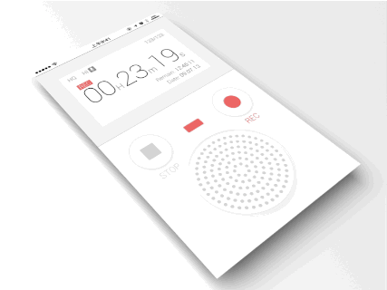

# KYVoiceCurve
类似Apple Watch中语音的声音曲线动画





##Usage
```
#import "VoiceCurveView.h"
```

Then,at the trigger method,like that:

```
  VoiceCurveView *voiceCurveView = [[VoiceCurveView alloc]initWithFrame:self.view.frame superView:self.view];
  [voiceCurveView present];        
```


